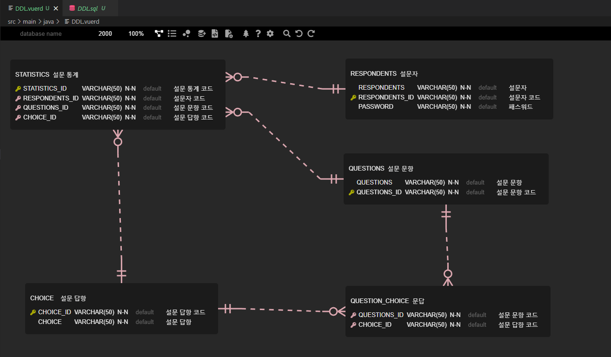

## 삼커벨 TEAM PROJECT(Polls With Members To Servlet)
### Poll TOPIC
<strong> 2023학년도 봄학기 대학원 학습자 만족도 및 튜터평가 설문 조사</strong>

### ✔️ 프로젝트 진행기간 
2023.06.27 ~ 2023.06.28 (2일)

### ✔️  MEMBER & PART 
| MEMBER | PART |
| ----------- | --------- |
| 김예빈 | ERD, DDL, DML / 통계(총 설문자 수) |
| 조효원 | 팀장 , 회원관리(전체,상세정보) ,전체적인검토 |
| 한희수 | 설문조사( 문항, 답항)| 

### ✔️ REFER

💻 화면정의서

💻 요구사항
| 구분 | 세부사항 |
| ----------- | --------- |
| 메뉴  | 원 관리, 로그인/아웃, 설문하기, 설문 통계   |
| 회원관리 | 전체 리스트(표시 항목 자유), 상세 정보   |
| 설문하기 | 설문지 구현 및 설문조사 받기   |
| 설문 통계 | 참여자 총수, 문항당 답항별 총 수 (옵션-테이블 표시) |

### ✔️ Run

- [YouTube구현영상](https://youtu.be/3k-kGiCFyKM)
  
### THE END 
저번 팀프로젝트보다 더 나아진 우리를 발견했다.

### ✔️사용 기술
     
